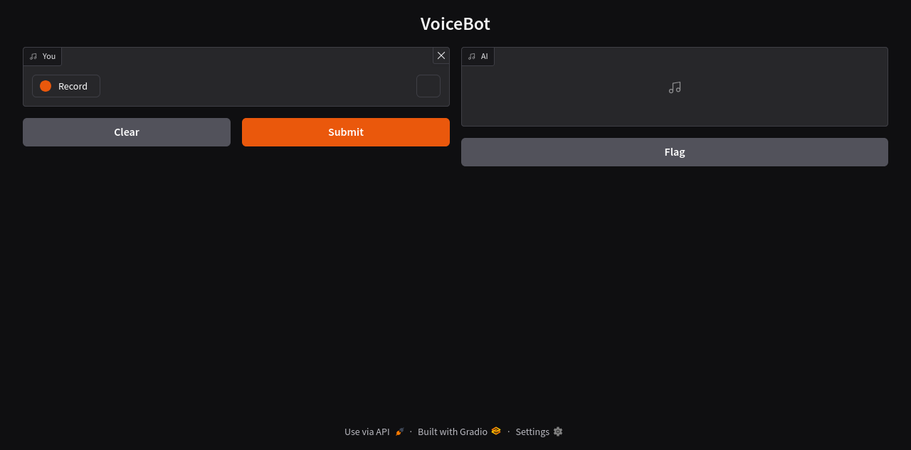

# Chat-Bot-DIVI
Prototipo Chatbot, facultad de ingeniería unlpam

# Instalación

## Prerrequisitos

### Hardware
**Mínimos**
- 2-4 GB de RAM y almacenamiento (libres)

### Software
- Python >= 3.11
- Ollama >= 0.5.13

### Librerías de Python
- ollama
- gradio
- dotenv
- elevenlabs

**Instalación**
`pip install -r requirements.txt`

## 1. Instalar modelo de IA
`ollama run deepseek-r1:1.5b`

El modelo puede ser intercambiado por otro más "inteligente". Consultar otras versiones en https://ollama.com/library/deepseek-r1

**Cambiar modelo**: en `src/app.py` buscar la variable **MODEL_AI** e igualarlo al modelo elegido `MODEL_AI = '<modelo>'`

## 2. Obtener api key de ElevenLabs

- Entrar a https://elevenlabs.io/ y registrarse.
- Crear una nueva api key con permiso para usar la IA y los modelos.
- Crear un archivo llamado ".env"
- Dentro del archivo, escribir `ELEVENLABS_API_KEY=<api key>` intercambiar `<api key>` por la tuya.

## 3. Ejecutar el proyecto
Entrar en `src/`. `cd src`

### Linux
`python3 app.py`

### Windows
`python app.py`

Cuando se ejecute por terminal, obtendremos la siguiente dirección `* Running on local URL:  http://127.0.0.1:7860`, http://127.0.0.1:7860 es el link para entrar a la app del chatbot desde el navegador.

